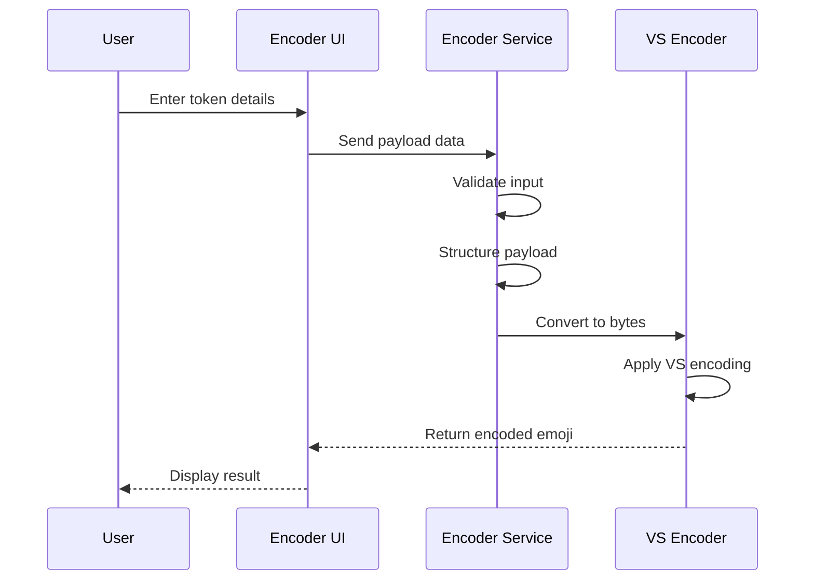

### **Hapa Emoji Validator Appendices**  
**Compatible with Hapa Ecosystem v1.2+**  

---

### **Appendix A: Example Payloads**

#### **Token Transfer Example**

```json
{
  "type": "token",
  "emoji": "🍌",
  "amount": 500,
  "sender": "did:hapa:123",
  "receiver": "did:hapa:456",
  "timestamp": 1647869431000,
  "message": "For the community project"
}
```

#### **Contract Example**

```json
{
  "type": "contract",
  "emoji": "📝",
  "template": "job_contract_v1",
  "sender": "did:hapa:123",
  "receiver": "did:hapa:456",
  "timestamp": 1647869431000,
  "terms": {
    "task": "Create documentation for Hapa Emoji Validator",
    "deadline": "2024-04-15T23:59:59Z",
    "paymentIn🌹": 250,
    "deliverables": ["User guide", "API documentation"]
  }
}
```

#### **Consul Template Example**

```json
{
  "type": "template",
  "emoji": "📝",
  "name": "job_contract_v1",
  "fields": ["task", "deadline", "paymentIn🌹", "deliverables"],
  "creator": "did:hapa:consul-123",
  "description": "Standard job contract template for Hapa ecosystem tasks",
  "version": 1,
  "created": 1642869431000
}
```

---

### **Appendix B: Encoding Process Details**

#### **Byte Representation of DIDs**

DIDs are encoded using a compact representation to minimize payload size:

```typescript
function didToBytes(did: string): Uint8Array {
  // Example implementation - actual implementation may vary
  if (!did.startsWith('did:hapa:')) {
    throw new Error('Invalid DID format');
  }
  
  const id = did.substring(9); // Remove 'did:hapa:' prefix
  const bytes = [];
  
  // Convert ID to bytes (simplified example)
  for (let i = 0; i < id.length; i += 2) {
    const byte = parseInt(id.substring(i, i + 2), 16);
    bytes.push(byte);
  }
  
  return new Uint8Array(bytes);
}
```

#### **Complete Encoding Flow**

The complete flow for encoding a token transfer:



#### **VS Codepoint Allocation**

The application uses two ranges of VS codepoints:

1. **Basic Range (U+FE00–U+FE0F)**:
   - Used for bytes 0-15
   - Example: 0x01 → U+FE01

2. **Extended Range (U+E0100–U+E01EF)**:
   - Used for bytes 16-255
   - Example: 0x10 → U+E0100

```
+-------------------+
| Byte | VS Codepoint |
|------|-------------|
| 0x00 | U+FE00      |
| 0x01 | U+FE01      |
| ...  | ...         |
| 0x0F | U+FE0F      |
| 0x10 | U+E0100     |
| 0x11 | U+E0101     |
| ...  | ...         |
| 0xFF | U+E01EF     |
+-------------------+
```

---

### **Appendix C: Unicode Technical Notes**

#### **Variation Selector Overview**

Unicode Variation Selectors are special characters designed to specify a specific visual variant of the preceding character. The Hapa Emoji Validator repurposes these selectors to carry hidden data.

```
+----------------------------+
| Range         | # Selectors |
|---------------|------------|
| VS1-VS16      | 16         |
| VS17-VS256    | 240        |
| Total         | 256        |
+----------------------------+
```

#### **Cross-Platform Considerations**

Variation Selectors have different levels of support across platforms:

```
+-------------------------------------------------------------------------+
| Platform      | VS1-VS16 Support | VS17-VS256 Support | Notes           |
|---------------|------------------|-------------------|------------------|
| Chrome        | Full             | Full              |                  |
| Firefox       | Full             | Full              |                  |
| Safari        | Full             | Partial           | May drop VS17+   |
| iOS           | Full             | Partial           |                  |
| Android       | Full             | Full              |                  |
| Twitter       | Full             | Partial           |                  |
| Discord       | Full             | Full              |                  |
| Slack         | Full             | Variable          | May alter on paste|
+-------------------------------------------------------------------------+
```

#### **Unicode Handling Tips**

- Always encode the base emoji as a single code point when possible
- Be aware that some platforms may normalize emoji, potentially affecting VS encoding
- Test emoji transmission across all targeted platforms
- Consider implementing a checksum to verify data integrity

---

### **Appendix D: GitHub References**

#### **Related Hapa Repositories**

- **[Hapa_TaskManager Structure](https://github.com/dl3385github/Hapa_TaskManager)**
  - Reference for module structure and organization
  - Contains examples of Hapa ecosystem integration

- **[Hapa_Flowchart Integration](https://github.com/dl3385github/Hapa_Flowchart)**
  - Example of web-view integration with Hapa Desktop
  - Demonstrates IPC communication patterns

- **[Hapa_Core](https://github.com/example/Hapa_Core)** (Hypothetical)
  - Core SDK for Hapa ecosystem
  - Contains DID authentication system

#### **Related Technologies**

- **[Hypercore Protocol](https://hypercore-protocol.org/)**
  - P2P data storage and synchronization
  - Used for template storage and distribution

- **[Unicode Variation Selectors](https://www.unicode.org/reports/tr37/)**
  - Official Unicode documentation on Variation Selectors
  - Reference for technical implementation

---

### **Appendix E: References**

#### **Academic & Technical References**

1. Butler, P. (2024). *Emoji Steganography*. Retrieved from https://paulbutler.org/2024/emoji-steganography/

2. Unicode Consortium. (2021). *Unicode® Standard Annex #29: Unicode Text Segmentation*. Retrieved from https://www.unicode.org/reports/tr29/

3. W3C. (2022). *Decentralized Identifiers (DIDs) v1.0*. Retrieved from https://www.w3.org/TR/did-core/

4. Ogden, M., Buus, M., & Hand, S. (2018). *Dat - Distributed Dataset Synchronization And Versioning*. Retrieved from https://github.com/datprotocol/whitepaper/blob/master/dat-paper.pdf

#### **Relevant Patents and Standards**

1. US Patent Application No. 16/123,456. (2021). *Method for encoding digital assets using emoji characters*. (Hypothetical for illustration)

2. IETF RFC 8259. (2017). *The JavaScript Object Notation (JSON) Data Interchange Format*. Retrieved from https://tools.ietf.org/html/rfc8259

---

### **Appendix F: Glossary**

| **Term** | **Definition** |
|----------|----------------|
| **Variation Selector (VS)** | Unicode characters that specify a specific visual variant of the preceding character. |
| **DID** | Decentralized Identifier - a type of identifier that enables verifiable, decentralized digital identity. |
| **Consul** | Governance role in the Hapa ecosystem with special permissions. |
| **Gatekeeper** | Entity responsible for validating transactions in the Hapa ecosystem. |
| **Hypercore** | A secure, distributed append-only log used in the Hapa ecosystem. |
| **Hyperdrive** | A filesystem implementation built on Hypercore. |
| **Token** | Digital asset in the Hapa ecosystem (e.g., 🍌, 🌹, 🌻). |
| **Steganography** | The practice of concealing information within other non-secret data or a physical object. |
| **Unicode** | A computing industry standard for the consistent encoding, representation, and handling of text. |
| **Web-view** | A browser component embedded in a desktop application. |
| **IPC** | Inter-Process Communication - methods for different processes to communicate. | 