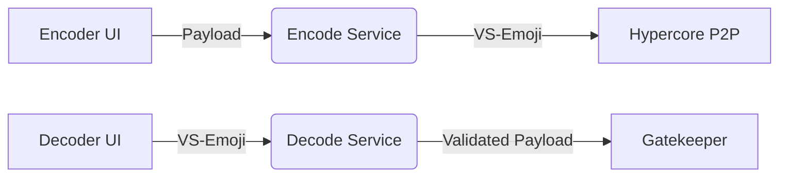

### **Hapa Emoji Validator Design Brief**  
**Compatible with Hapa Ecosystem v1.2+**  

---

### **Product Vision**
Hapa Emoji Validator transforms complex token transactions and contracts into visually intuitive emojis. By leveraging Unicode Variation Selectors, we enable users to encode/decode Hapa ecosystem data in a format that's easy to share and universally recognized.

---

### **UI/UX Design**

#### **Encoder Interface**
The encoder interface will provide an intuitive way for users to create emoji-encoded tokens and contracts.

**Key Components:**
- Emoji picker with Hapa tokens (`🍌`, `🌹`, `🌻`) + custom Consul emojis
- Input fields for:
  - Token amount
  - Recipient DID
  - Contract terms (JSON editor for advanced users)
- "Encode" button that generates VS-laden emoji
- Preview section showing how the emoji will appear in messages

**User Flow:**
1. Select base emoji (token type or contract template)
2. Fill in required fields based on emoji type
3. Click "Encode" button
4. Copy encoded emoji to clipboard or share directly

#### **Decoder Interface**
The decoder interface will allow users to extract and view data embedded in encoded emojis.

**Key Components:**
- Text area for pasting encoded emojis
- "Decode" button
- Results display showing:
  - Sender information (DID)
  - Token amount or contract details
  - Timestamp
- Hover tooltip functionality showing summary

**User Flow:**
1. Paste encoded emoji into text area
2. System automatically detects and decodes emoji
3. View detailed breakdown of embedded data
4. Accept/reject transaction (if applicable)

#### **Visual Design Elements**
- Clean, minimal interface with focus on the emoji and input fields
- Color scheme aligned with Hapa's existing design language
- Responsive design for both desktop and mobile use
- Interactive elements that provide visual feedback on hover/click
- Error states with clear guidance for resolution

#### **Mockup: Encoder Interface**
```
+----------------------------------------+
|  Hapa Emoji Validator - Encode         |
+----------------------------------------+
|                                        |
|  Select Token:  🍌 🌹 🌻 📝 ⚒️ [+]    |
|                                        |
|  Amount: [____500_____________________]|
|                                        |
|  Recipient: [_did:hapa:456_____________]|
|                                        |
|  [+ Add custom field]                  |
|                                        |
|  Preview: 🍌                           |
|                                        |
|  [ENCODE]                              |
|                                        |
|  Result: 🍌󠄀󠄁 (Copy to clipboard)      |
|                                        |
+----------------------------------------+
```

#### **Mockup: Decoder Interface**
```
+----------------------------------------+
|  Hapa Emoji Validator - Decode         |
+----------------------------------------+
|                                        |
|  Paste emoji: [🍌󠄀󠄁__________________]|
|                                        |
|  [DECODE]                              |
|                                        |
|  Results:                              |
|  • Type: Token (Bananas)               |
|  • Amount: 500                         |
|  • Sender: did:hapa:123                |
|  • Recipient: did:hapa:456             |
|  • Timestamp: 2024-03-21 14:30 UTC     |
|                                        |
|  [ACCEPT] [REJECT]                     |
|                                        |
+----------------------------------------+
```

---

### **Backend Architecture**

The backend architecture will support both encoding and decoding operations while ensuring security and performance.



#### **Core Components**

1. **Encode Service**
   - Accepts user input from frontend
   - Validates input data
   - Converts payload to bytes
   - Appends VS codepoints to base emoji
   - Returns encoded emoji to UI

2. **Decode Service**
   - Accepts encoded emoji from UI
   - Extracts VS codepoints
   - Converts to bytes
   - Parses into structured data
   - Validates structure against templates
   - Returns decoded payload to UI

3. **Validation Layer**
   - Checks sender's DID authenticity
   - Verifies token balances (mock until crypto-system is live)
   - Validates against Consul governance rules
   - Prevents malicious payloads

4. **Hypercore Integration**
   - Ensures encoded emojis survive P2P transmission
   - Provides access to Consul-defined templates
   - Enables persistent storage of transaction history

---

### **Design Principles**

1. **Simplicity**: Make encoding/decoding as intuitive as possible
2. **Visual Clarity**: Use familiar emoji representations for complex data
3. **Consistency**: Follow Hapa's existing design patterns
4. **Feedback**: Provide clear feedback on all user actions
5. **Security**: Validate all inputs and encoded data
6. **Accessibility**: Ensure interface is accessible to all users
7. **Extensibility**: Design for future expansion of emoji types 