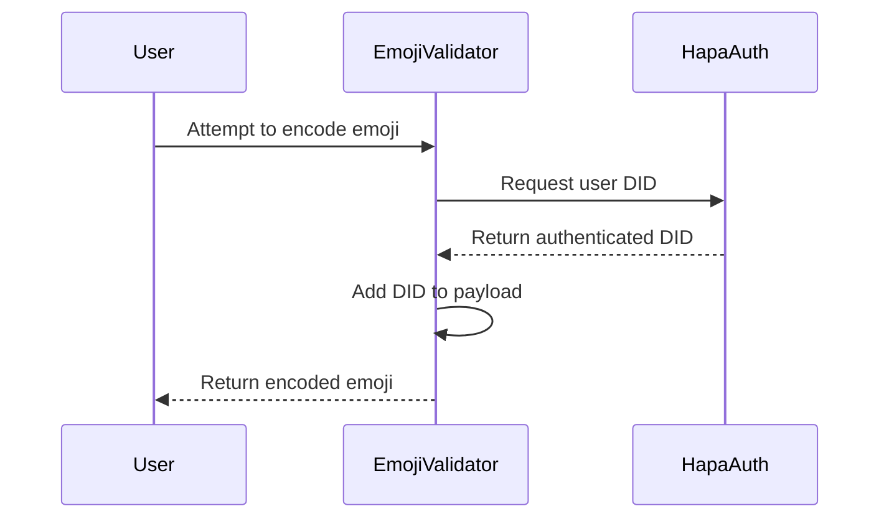

### **Hapa Emoji Validator Integration Plan**  
**Compatible with Hapa Ecosystem v1.2+**  

---

### **Integration Overview**

The Hapa Emoji Validator will be developed as a standalone application with the ability to integrate with the broader Hapa ecosystem. This document outlines the integration points, dependencies, and implementation strategies.

---

### **Standalone Application**

#### **Development Approach**
- Develop as a standalone Vite application with React
- Enable running independently for users who only need encoding/decoding functionality
- Package as a downloadable desktop application using Electron (optional)

#### **Deployment Strategy**
- Host web version on standard web hosting (Vercel, Netlify, etc.)
- Provide desktop builds for macOS, Windows, and Linux
- Enable offline functionality for basic encoding/decoding

---

### **Hapa Ecosystem Integration**

#### **1. Electron Web-View Integration**

The Hapa Emoji Validator will be embedded as a tab in the Hapa Desktop application, similar to the [Hapa_Flowchart](https://github.com/dl3385github/Hapa_Flowchart) integration.

**Implementation Steps:**
1. Package the Emoji Validator as a web application
2. Embed in Hapa Desktop using Electron's `<webview>` tag
3. Implement IPC communication between the web-view and Hapa's main process:
   ```typescript
   // In the web-view
   window.postMessage({
     type: 'ENCODE_EMOJI',
     payload: {
       emoji: '🍌',
       amount: 500,
       receiver: 'did:hapa:456'
     }
   }, '*');
   
   // In Hapa's main process
   webview.addEventListener('ipc-message', (event) => {
     if (event.channel === 'ENCODE_EMOJI') {
       // Process the request
     }
   });
   ```

#### **2. Consul Governance Integration**

The Emoji Validator will support Consul governance for custom emoji templates, stored in Hyperdrive.

**Implementation Steps:**
1. Create a standardized JSON schema for emoji templates
2. Implement Hyperdrive storage for templates at `hyperdrive:/consul-emojis`
3. Develop template management UI for Consuls
4. Add template fetching and validation logic

**Example Template:**
```json
// 📝_contract.json
{
  "type": "contract",
  "emoji": "📝",
  "fields": ["task", "paymentIn🌹", "deadline"],
  "creator": "did:hapa:consul-123",
  "description": "Standard job contract template",
  "version": 1
}
```

#### **3. DID Authentication Integration**

The Emoji Validator will leverage Hapa's existing DID authentication system.

**Implementation Steps:**
1. Implement DID authentication hooks
2. Add sender verification for transactions
3. Auto-fill user's DID when encoding emojis
4. Validate DIDs during the decode process

**Authentication Flow:**


#### **4. Hypercore P2P Integration**

The Emoji Validator will use Hypercore for P2P messaging and template storage.

**Implementation Steps:**
1. Implement Hypercore feed for template discovery
2. Add Hypercore-based messaging for encoded emojis
3. Ensure VS-laden emojis survive P2P transmission
4. Add transaction history using append-only logs

**Example Usage:**
```typescript
// Initialize Hypercore connection
const core = new Hypercore('./storage/consul-templates')

// Fetch templates
const templateStream = core.createReadStream({ live: true })
templateStream.on('data', template => {
  // Add template to available emojis
})

// Publish new template (Consul only)
await core.append(JSON.stringify(newTemplate))
```

---

### **Third-Party Service Integration**

#### **1. Social Media Sharing**

Enable sharing encoded emojis to social media platforms.

**Implementation Steps:**
1. Add share buttons for common platforms (Twitter, Discord, etc.)
2. Verify emoji rendering across platforms
3. Implement copy-to-clipboard functionality with success feedback

#### **2. Hapa_TaskManager Integration**

Connect with [Hapa_TaskManager](https://github.com/dl3385github/Hapa_TaskManager) for contract-based tasks.

**Implementation Steps:**
1. Develop shared contract format
2. Implement direct task creation from decoded contracts
3. Add task status visualization in decoded emojis

---

### **API Integration**

Provide a REST API for third-party applications to encode and decode emojis.

#### **API Endpoints**
1. `POST /api/encode` - Encode payload into emoji
2. `POST /api/decode` - Decode emoji into structured data
3. `GET /api/templates` - List available templates
4. `GET /api/tokens` - List supported token types

#### **Authentication**
- Use API keys for third-party applications
- Implement rate limiting to prevent abuse
- Require DID authentication for sensitive operations

---

### **Integration Testing**

| **Test Case** | **Description** | **Success Criteria** |
|---------------|-----------------|----------------------|
| Emoji Persistence | Test if encoded emojis survive transmission across platforms | Decoded data matches original |
| Hypercore Sync | Test template syncing across nodes | Templates match on all nodes |
| DID Authentication | Test authentication flow | User's DID correctly included in encoding |
| Web-View IPC | Test communication between web-view and main process | Messages received and processed correctly |
| Social Media Sharing | Test emoji rendering on social platforms | Emojis display correctly with VS data intact |

---

### **Rollout Strategy**

1. **Phase 1 (Q1 2024)**: Standalone web application
   - Basic encoding/decoding functionality
   - Mock Consul templates

2. **Phase 2 (Q2 2024)**: Hapa Ecosystem Integration
   - DID authentication integration
   - Hypercore P2P messaging
   - Consul governance implementation

3. **Phase 3 (Q3 2024)**: Full Integration
   - Web-view integration in Hapa Desktop
   - API for third-party applications
   - Social media optimizations 