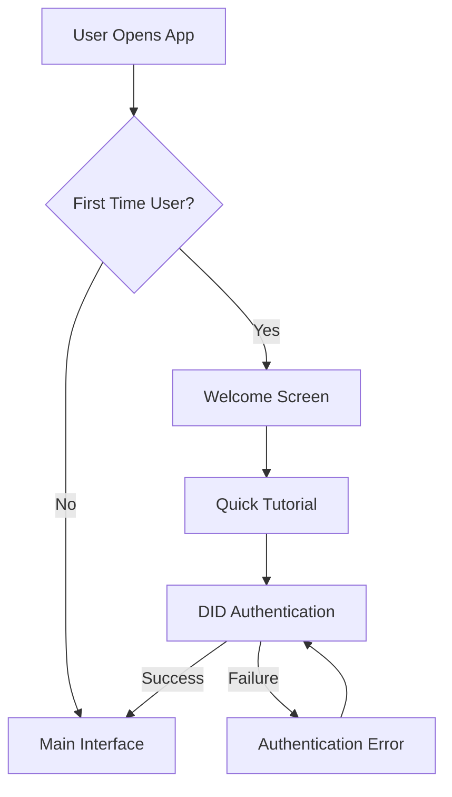
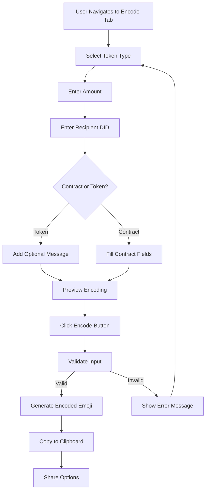
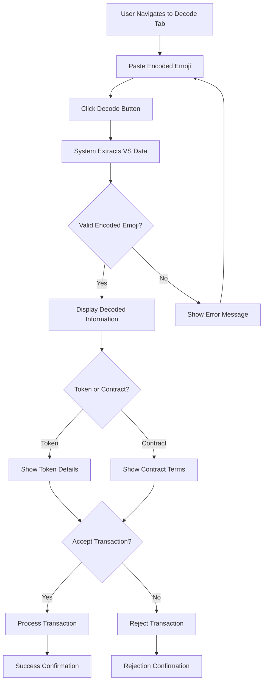
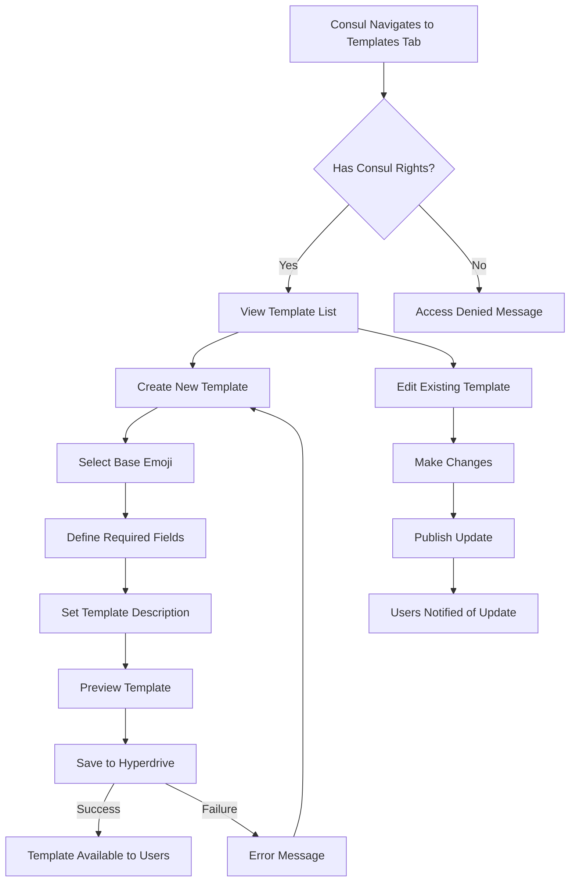

### **Hapa Emoji Validator User Flow**  
**Compatible with Hapa Ecosystem v1.2+**  

---

This document outlines the user flows for the Hapa Emoji Validator application, detailing the steps users take to complete key tasks within the application, from onboarding to encoding and decoding emojis.

---

### **1. User Onboarding Flow**

#### **First-Time User Experience**

1. **Welcome Screen**
   - Brief introduction to Hapa Emoji Validator
   - Overview of key features and benefits
   - "Get Started" button

2. **Quick Tutorial**
   - Step-by-step guide showing how to encode and decode emojis
   - Visual examples of emoji encodings
   - Skip option for experienced users

3. **DID Authentication**
   - Connect with Hapa's DID system
   - Authenticate user identity
   - Store authentication for future sessions

---

### **2. Emoji Encoding Flow**

#### **Encoding Task Flow**

1. **Select Token Type**
   - User clicks on the Encode tab
   - Selects token type from emoji options (🍌, 🌹, 🌻) or contract templates (📝)
   - Selection highlights the chosen emoji

2. **Enter Transaction Details**
   - For tokens: Enter amount and recipient DID
   - For contracts: Fill in template-specific fields (task, deadline, payment)
   - Optional fields for additional metadata

3. **Preview and Encode**
   - System shows preview of the encoding
   - User clicks "Encode" button
   - System validates all inputs and generates the encoded emoji
   - Success message with encoded emoji displayed

4. **Copy and Share**
   - User can copy the encoded emoji to clipboard
   - Share options for direct sending via Hapa P2P messaging
   - Success confirmation when copied

#### **Edge Cases and Error Handling**

- **Invalid DID**: Show error message with proper DID format
- **Insufficient Tokens**: Notify user of insufficient balance
- **Missing Required Fields**: Highlight missing fields in red
- **Oversized Payload**: Alert that data exceeds 64-byte limit

---

### **3. Emoji Decoding Flow**

#### **Decoding Task Flow**

1. **Input Encoded Emoji**
   - User navigates to the Decode tab
   - Pastes encoded emoji into the text field
   - System detects valid emoji input

2. **Decode and Validate**
   - User clicks "Decode" button (or auto-decode on paste)
   - System extracts Variation Selector data
   - Validates the structure of encoded data
   - Parses into structured information

3. **Display Information**
   - For tokens: Show sender, amount, token type, timestamp
   - For contracts: Display all contract terms and conditions
   - Visualize information in a clear, organized layout

4. **Transaction Actions**
   - User can accept or reject the transaction
   - If accepted, system processes the transaction
   - Confirmation message for accepted/rejected transaction

#### **Edge Cases and Error Handling**

- **Invalid Emoji**: Show message that the emoji contains no encoded data
- **Corrupted Data**: Alert that the encoding is damaged or incomplete
- **Unsupported Template**: Notify that the contract template is unavailable
- **Already Processed**: Inform if the transaction has already been processed

---

### **4. Consul Template Management Flow**

#### **Template Management Task Flow**

1. **Access Template Management**
   - User with Consul rights navigates to Templates tab
   - System verifies Consul status via DID authentication
   - Displays current templates and creation options

2. **Create New Template**
   - Consul selects base emoji for the template
   - Defines required fields and their types
   - Sets description and usage instructions
   - Previews how template will appear to users

3. **Publish and Distribute**
   - Template is saved to Hyperdrive storage
   - System assigns unique template ID
   - Template becomes available to all users
   - Notification sent to interested users

4. **Template Management**
   - Consul can update or deprecate templates
   - Version control for template changes
   - Usage statistics for template adoption

---

### **5. Alternative Flows**

#### **Guest Mode**

For users without Hapa DID authentication:

1. **Limited Functionality Access**
   - Can decode received emojis to view content
   - Cannot encode new transactions (requires DID)
   - Prompted to create/connect DID for full access

2. **Read-Only Template View**
   - Can view available templates
   - Cannot create or use templates for encoding

#### **Offline Mode**

When network connection is unavailable:

1. **Cached Templates**
   - Use previously downloaded templates
   - Indicator showing offline status
   - Queue transactions for processing when online

2. **Limited Validation**
   - Basic structure validation only
   - Cannot verify balances or DID authenticity
   - Warning message about limited validation

---

### **6. User Permissions**

| **User Role** | **Encoding** | **Decoding** | **Template Creation** | **Template Usage** |
|---------------|--------------|--------------|----------------------|-------------------|
| Guest | ❌ | ✅ | ❌ | ❌ |
| Authenticated User | ✅ | ✅ | ❌ | ✅ |
| Consul | ✅ | ✅ | ✅ | ✅ |
| Gatekeeper | ✅ | ✅ | ✅ | ✅ |

---

### **7. Notifications**

| **Event** | **Notification Type** | **Recipients** | **Action Required** |
|-----------|----------------------|----------------|---------------------|
| Received Token | Pop-up + Badge | Recipient | Accept/Reject |
| Received Contract | Pop-up + Badge | Recipient | Review/Sign |
| Template Update | Banner | Template Users | Acknowledge |
| Transaction Processed | Toast Notification | Sender | None |
| Balance Update | Status Update | Token Owner | None | 